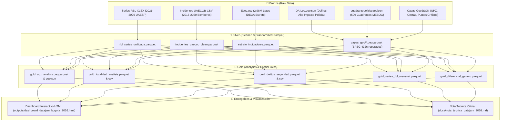

# 🏙️ DataJam Bogotá 2026 — Observatorio Territorial de Residuos, Seguridad Ciudadana y Emergencias

[](https://www.python.org/)
[](https://geopandas.org/)
[]()
[]()

> Repositorio oficial y pipeline analítico reproducible para el **DataJam Bogotá 2026**.  
> Estudio integrado de la **triple vulnerabilidad urbana**: Inequidad en infraestructura de aseo (UAESP), Emergencias urbanas e incendios (UAECOB) y Delitos de Alto Impacto / Cuadrantes Policiales (MEBOG - DAILoc) en Bogotá D.C. (2016–2026).

---

## 📌 Tabla de Contenidos
1. [Resumen Ejecutivo & Hipótesis](#-resumen-ejecutivo--hipótesis)
2. [Metodología DataJam en 5 Pasos](#-metodología-datajam-en-5-pasos)
3. [Arquitectura de Datos (Medallion: Bronze ➔ Silver ➔ Gold)](#-arquitectura-de-datos)
4. [Estructura del Proyecto](#-estructura-del-proyecto)
5. [Guía de Reproducibilidad y Ejecución](#-guía-de-reproducibilidad-y-ejecución)
6. [Hallazgos Principales Validados](#-hallazgos-principales-validados)
7. [Entregable: Dashboard Interactivo](#-entregable-dashboard-interactivo)
8. [Recomendaciones de Política Pública Articulada](#-recomendaciones-de-política-pública-articulada)

---

## 🎯 Resumen Ejecutivo & Hipótesis

* **Pregunta Central:** ¿Existe una relación espacial y estadística significativa entre la vulnerabilidad socioeconómica (estratos 1 y 2), el déficit de infraestructura de aseo formal, la proliferación de puntos críticos de basura y la ocurrencia simultánea de delitos violentos y emergencias urbanas en Bogotá?
* **Hipótesis Confirmada:** Las localidades y UPZ de estratos 1 y 2 sufren un **déficit extremo de mobiliario de aseo** (hasta 10 veces menos cestas por habitante), concentran la **mayoría de los 478 puntos críticos de arrojo clandestino** y presentan las **tasas más altas de homicidios, violencia intrafamiliar y emergencias por fuego**.

---

## 🧭 Metodología DataJam en 5 Pasos

1. **Territorio:** Distrito Capital de Bogotá desagregado en 20 localidades, 117 Unidades de Planeamiento Zonal (UPZ) y 599 cuadrantes policiales de la MEBOG.
2. **Fenómeno:** Disparidad en infraestructura pública de aseo, arrojo ilegal de escombros/basuras, emergencias por fuego y delitos de alto impacto (homicidios, violencia intrafamiliar y hurtos).
3. **Pregunta:** ¿Cómo convergen espacialmente el déficit de aseo, los crímenes y las emergencias en función del estrato socioeconómico?
4. **Hipótesis:** Las zonas populares experimentan una convergencia de pasivos ambientales y riesgos de seguridad que exige intervención integral.
5. **Variables:** Estrato modal, tasa de cestas/10k hab, densidad de puntos críticos/km², 11.445 homicidios, 562.000 casos de violencia intrafamiliar, 166.977 emergencias de bomberos y 2.24M ton/año de residuos.

---

## 🏗️ Arquitectura de Datos



---

## 📁 Estructura del Proyecto

```text
DataJamBlackStar/
├── Bronze/                     # Datasets públicos originales (inmutables)
├── Silver/                     # Capas limpias y estandarizadas (.parquet)
│   └── capas_geo/              # Geometrías reparadas y reproyectadas (.geoparquet)
├── Gold/                       # Tablas maestras agregadas para analítica (.parquet, .geojson)
│   ├── gold_upz_analisis.geoparquet & .geojson
│   ├── gold_localidad_analisis.parquet & .csv
│   ├── gold_delitos_seguridad.parquet & .csv
│   ├── gold_series_rbl_mensual.parquet & .csv
│   ├── gold_series_incidentes_mensual.parquet & .csv
│   └── gold_diferencial_genero.parquet & .csv
├── notebooks/                  # Notebooks Jupyter de Análisis Exploratorio (EDA)
│   ├── 01_eda_rbl_series_temporales.ipynb
│   ├── 02_eda_capas_geoespaciales.ipynb
│   ├── 03_eda_incidentes_uaecob.ipynb
│   ├── 04_eda_estratificacion_indicadores.ipynb
│   └── scripts/                # Scripts Python automatizados del pipeline
│       ├── 01_build_silver_rbl.py
│       ├── 02_build_silver_geo.py
│       ├── 03_build_silver_incidentes.py
│       ├── 04_build_silver_estratos.py
│       ├── 05_build_gold_analisis.py
│       └── 06_build_dashboard.py
├── outputs/                    # Gráficos exportados y Dashboard HTML final
│   └── dashboard_datajam_bogota_2026.html
├── docs/                       # Documentación y nota técnica oficial
│   └── nota_tecnica_datajam_2026.md
├── requirements.txt            # Dependencias fijadas del proyecto
└── README.md                   # Documentación general
```

---

## 🚀 Guía de Reproducibilidad y Ejecución

```bash
# 1. Configurar entorno
python -m venv .venv
source .venv/bin/activate
pip install -r requirements.txt

# 2. Ejecutar Pipeline Completo
python notebooks/scripts/01_build_silver_rbl.py
python notebooks/scripts/02_build_silver_geo.py
python notebooks/scripts/03_build_silver_incidentes.py
python notebooks/scripts/04_build_silver_estratos.py
python notebooks/scripts/05_build_gold_analisis.py
python notebooks/scripts/06_build_dashboard.py

# 3. Abrir Dashboard Local
xdg-open outputs/dashboard_datajam_bogota_2026.html  # Linux
open outputs/dashboard_datajam_bogota_2026.html      # macOS
start outputs/dashboard_datajam_bogota_2026.html     # Windows
```

---

## 💡 Hallazgos Principales Validados

1. **La Brecha de Cestas ($r = +0.74$):**
   * Teusaquillo y Chapinero cuentan con **285 a 337 cestas por cada 10.000 habitantes**.
   * Bosa y Ciudad Bolívar cuentan con apenas **29 cestas por cada 10.000 habitantes** (brecha de 10 a 1).
2. **Convergencia Crimen vs Basuras ($r = +0.68$):**
   * Fuerte correlación entre homicidios y puntos de arrojo clandestino: **Ciudad Bolívar (892 homicidios, 37 puntos)**, **Kennedy (668 homicidios, 71 puntos)** y **Bosa (439 homicidios, 56 puntos)**.
3. **Violencia Intrafamiliar en Entornos Deteriorados ($r = +0.87$):**
   * Concentración masiva en Kennedy (20.001 casos), Suba (19.848 casos) y Ciudad Bolívar (19.372 casos).
4. **Emergencias Urbanas (UAECOB):**
   * El **74.7% de los 166.977 incidentes** ocurren en estratos 2 y 3.
5. **Enfoque Diferencial de Género y Niñez:**
   * El **82% de las niñas y niños expuestos** a situaciones de riesgo por incendios estructurales habitan en estratos 1, 2 y 3.

---

## 💻 Entregable: Dashboard Interactivo

El archivo autónomo [`outputs/dashboard_datajam_bogota_2026.html`](file:///home/naciscric/Documentos/DataJamBlackStar/outputs/dashboard_datajam_bogota_2026.html) no requiere servidores ni conexión a internet. Incluye:
* **Mapa Territorial Leaflet:** UPZ por Índice de Vulnerabilidad, Puntos Críticos de Arrojo, Cuadrantes de Policía (MEBOG) y Estaciones de Bomberos.
* **Módulo de Hipótesis y Seguridad:** Gráficos Plotly interactivos de dispersión de crimen, cestas, puntos de arrojo y delitos de alto impacto por localidad.
* **Series Temporales:** Histórico de residuos (2021-2026) e incidentes (2016-2020).
* **Módulo de Género y Matriz de Decisión Territorial.**

---

## 🏛️ Recomendaciones de Política Pública Articulada

1. **Rebalanceo de Mobiliario (UAESP):** Instalar **15.000 nuevas cestas públicas y 3.000 contenedores** en las 20 UPZ con mayor índice de vulnerabilidad territorial.
2. **Estrategia Mixta en Puntos Críticos (Secretaría de Seguridad + MEBOG + UAESP):** Patrullaje de cuadrantes y cámaras en los 478 puntos de arrojo para desarticular focos de contaminación y criminalidad.
3. **Prevención Comunitaria con Enfoque de Género (UAECOB + SDMujer):** Capacitación barrial liderada por redes de mujeres cuidadoras en zonas vulnerables.

# LINK DE LA DATA
[AQUI](https://drive.google.com/drive/folders/1jQZh3PLFPnMqk9hLOA2zVPJMGfBdlYMB?usp=drive_link)