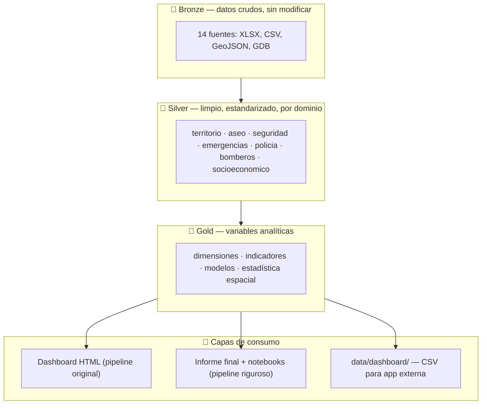

# 🏙️ DataJam Bogotá 2026 — Observatorio Territorial de Residuos, Seguridad Ciudadana y Emergencias

[](https://www.python.org/)
[](https://geopandas.org/)
[]()
[]()

> Repositorio oficial y pipeline analítico reproducible para el **DataJam Bogotá 2026**.
> Estudio integrado de la **triple vulnerabilidad urbana**: inequidad en infraestructura de aseo (UAESP), emergencias urbanas e incendios (UAECOB) y delitos de alto impacto (Secretaría de Seguridad — DAILoc) en Bogotá D.C. (2016–2026), cruzados con el estrato socioeconómico oficial.

Este repositorio contiene **dos pipelines**:

1. **Pipeline original** (`notebooks/`, 6 scripts) — primera versión del análisis, con hallazgos por correlación simple.
2. **Pipeline riguroso ampliado** (`01_ingesta/` … `15_dashboard_export/`) — auditoría formal de datos, estadística espacial (Moran's I, LISA, Getis-Ord Gi*), modelos multivariables (Binomial Negativa) con control de confusores, análisis de robustez/MAUP, y una capa de datos exportada para un dashboard externo.

👉 **El pipeline riguroso matiza los hallazgos del original**: las correlaciones simples (r=0.74, r=0.68) son reales pero están mediadas por el estrato socioeconómico una vez se controla estadísticamente por vulnerabilidad — no son un mecanismo de causación directo entre déficit de aseo → arrojo → delitos. Ver conclusiones actualizadas en [`14_resultados/informe_final.md`](14_resultados/informe_final.md).

---

## 📌 Tabla de Contenidos

1. [Descripción del problema](#-1-descripción-del-problema)
2. [Fuentes de datos utilizadas](#-2-fuentes-de-datos-utilizadas)
3. [Metodología general](#-3-metodología-general)
4. [Estructura del repositorio](#-4-estructura-del-repositorio)
5. [Instrucciones de despliegue](#-5-instrucciones-de-despliegue)
6. [Instrucciones de ejecución](#-6-instrucciones-de-ejecución)
7. [Hallazgos principales](#-7-hallazgos-principales)
8. [Entregables](#-8-entregables)

---

## 🎯 1. Descripción del problema

### Contexto

Bogotá presenta una distribución territorial heterogénea de tres fenómenos urbanos que, hasta ahora, se analizaban por separado desde entidades distintas: la Unidad Administrativa Especial de Servicios Públicos (aseo), la Unidad Administrativa Especial Cuerpo Oficial de Bomberos (emergencias) y la Secretaría Distrital de Seguridad, Convivencia y Justicia (delitos de alto impacto). Esta fragmentación institucional impide identificar si los tres fenómenos se concentran en las mismas zonas de la ciudad y si esa concentración está asociada al estrato socioeconómico.

### Pregunta central

> ¿Existe una relación espacial y estadísticamente significativa entre la vulnerabilidad socioeconómica, el déficit de infraestructura de aseo formal, la proliferación de puntos críticos de arrojo clandestino y la ocurrencia de delitos de alto impacto y emergencias urbanas en Bogotá?

### Objetivos

1. Integrar en una sola arquitectura de datos (Medallion: Bronze → Silver → Gold) las fuentes abiertas de aseo, seguridad, emergencias y estratificación de Bogotá.
2. Construir indicadores territoriales comparables a nivel UPZ y localidad.
3. Contrastar estadísticamente 7 hipótesis (H1–H7) sobre la relación entre vulnerabilidad, déficit de aseo, arrojo clandestino, delitos y emergencias — con estadística espacial formal, no solo correlación simple.
4. Producir un dashboard interactivo y una capa de datos reutilizable para visualización externa.

### Fuera de alcance (esta fase)

Modelos predictivos, machine learning, índices de priorización de intervención o recomendaciones automáticas de política pública. El proyecto actual es **descriptivo, espacial y estadístico** — responde "¿qué está pasando y dónde?", no "¿qué deberíamos hacer?".

---

## 📊 2. Fuentes de datos utilizadas

Se integraron **14 fuentes** del Portal de Datos Abiertos de Bogotá y de la Infraestructura de Datos Espaciales del Distrito Capital (IDECA). Los datos crudos (`Bronze/`) **no se versionan en este repositorio** por su peso (>2 GB, con archivos individuales de hasta 1.1 GB) — se descargan desde el enlace al final de este documento.

| # | Fuente | Entidad | Formato | Variables clave |
|---|---|---|---|---|
| 1 | Datos de residuos recogidos (RBL) | UAESP | XLSX/CSV | toneladas recogidas por tipo, ASE, mes |
| 2 | Incidente atendido por bomberos | UAECOB | CSV | tipo de incidente, localidad, UPZ, estrato autorreportado, género/niñez expuesta |
| 3 | Delito de alto impacto (DAILoc) | Secretaría Distrital de Seguridad | GeoJSON | homicidios, hurtos, violencia intrafamiliar por localidad y año |
| 4 | Cuadrantes de policía | MEBOG | GeoJSON | polígonos de cobertura policial |
| 5 | Estratificación para Bogotá (manzana) | Secretaría Distrital de Planeación | GeoJSON | estrato 1–6 por manzana con geometría real |
| 6 | Estrato socioeconómico (Esoc) | IDECA / Catastro | CSV (vía GDB) | estrato por unidad catastral (CHIP) — sin llave espacial directa a UPZ |
| 7 | Mapa de Referencia — UPZ | IDECA | GeoJSON | polígonos de las 112 UPZ urbanas |
| 8 | Mapa de Referencia — localidades | IDECA | GeoJSON | polígonos de las 20 localidades |
| 9 | Cestas | UAESP | GeoJSON | ubicación y estado de cestas públicas |
| 10 | Contenerización | UAESP | GeoJSON | ubicación de contenedores |
| 11 | Puntos críticos de arrojo clandestino | UAESP | GeoJSON | ubicación, frecuencia, observación |
| 12 | Macrorutas de barrido | UAESP | GeoJSON | cobertura de barrido mecánico/manual |
| 13 | Estación de bomberos | UAECOB | GeoJSON | ubicación de las 17 estaciones |
| 14 | Hábitat en cifras — indicadores urbanos | Secretaría Distrital del Hábitat | XLSX | parques, uso del suelo, % predios por estrato |

**Consideraciones sobre la obtención de los datos:**

- Todas las fuentes son de acceso público (`datosabiertos.bogota.gov.co`, `ideca.gov.co`), no requieren credenciales ni autenticación.
- La fuente #5 (estratificación por manzana) se incorporó en una segunda etapa del proyecto: la fuente #6 (Esoc) no tiene una llave espacial verificable a UPZ/localidad, así que se reemplazó como variable principal de vulnerabilidad — ver `02_auditoria/reporte_auditoria.md` sección 4.1.
- No existe en ninguna de las 14 fuentes un dato oficial de **población por UPZ o localidad** — esto está documentado como limitación explícita en todo el pipeline (no se aproxima ni se inventa).
- Descarga de `Bronze/`: ver [enlace de datos](#-enlace-de-datos-crudos) al final de este documento.

---

## 🧭 3. Metodología general

### Arquitectura de datos (Medallion)



### Pipeline riguroso — 15 fases

| Fase | Carpeta | Qué hace |
|---|---|---|
| 1 | `01_ingesta/` | Catálogo de las 14 fuentes en Bronze (formato, tamaño, columnas) |
| 2 | `02_auditoria/` | Auditoría de calidad: geometrías inválidas, duplicados, nulos, CRS, cobertura temporal — **antes** de transformar nada |
| 3–4 | `03_limpieza/` | Normalización por dominio, con tabla de trazabilidad (fuente → transformación → motivo → registros afectados) |
| 5 | `05_integracion_espacial/` | *Spatial joins* reales (point-in-polygon, `within`/`intersects`) — no *matching* por texto |
| 6 | `06_construccion_variables/` | Dataset maestro UPZ/localidad, panel UPZ×año, datasets por hipótesis, diccionario de datos |
| 7 | `07_eda/` | Análisis exploratorio (distribuciones, mapas, correlaciones) |
| 8 | `08_estadistica/` | Matriz de correlación con corrección por comparaciones múltiples (FDR) |
| 9 | `09_estadistica_espacial/` | Moran's I global, LISA (Moran local), Getis-Ord Gi*, Moran bivariado |
| 10 | `10_modelos/` | Modelos de conteo (Poisson/Binomial Negativa) con control de confusores y VIF |
| 11 | `11_espacio_temporal/` | Tendencias, años atípicos, zonas persistentes vs. emergentes |
| 12 | `12_validacion/` | Robustez: UPZ vs. localidad (MAUP), distintas especificaciones, distintos períodos |
| 13 | `13_visualizacion/` | Mapas finales (LISA, hotspots, superposición, zonas prioritarias) |
| 14 | `14_resultados/` | Informe final consolidado |
| 15 | `15_dashboard_export/` | Exporta `data/dashboard/` — capa de consumo para una app externa, sin modelos predictivos |

### Técnicas estadísticas empleadas

- **Espaciales:** Moran's I global y local (LISA), Getis-Ord Gi\*, Moran bivariado, matrices de pesos espaciales Queen y KNN.
- **Multivariables:** GLM Poisson y Binomial Negativa (según sobredispersión), con *offset* de área para modelar tasas.
- **Robustez:** comparación UPZ vs. localidad (MAUP), conteo crudo vs. densidad vs. log-densidad, distintos períodos temporales, distintas matrices de pesos.
- **Validación:** corrección de p-values por comparaciones múltiples (Benjamini-Hochberg), pruebas de normalidad (Shapiro-Wilk) para elegir Pearson vs. Spearman.

---

## 📁 4. Estructura del repositorio

El repositorio sigue estrictamente el estándar de entregables del **DataJam Bogotá 2026**:

```text
├── main.py                             # Orquestador integral ejecutable de todo el pipeline (30 tareas)
├── README.md                           # Documentación completa del proyecto y metodología
├── requirements.txt                    # Dependencias fijadas y verificadas
├── .gitignore
│
├── data/                               # Arquitectura Medallion y capas de consumo
│   ├── bronze/                         # 14 fuentes crudas sin modificar (NO versionado — ver sección 5)
│   ├── silver/                         # Capa limpia y estandarizada por dominio (territorio, aseo, etc.)
│   ├── gold/                           # Capa analítica: modelos, variables consolidadas y rankings
│   └── dashboard/                      # Capa de consumo estructurada para visualización externa (CSV/GeoJSON)
│       ├── dimensions/  indicators/  spatial/  temporal/  hypotheses/  metadata/
│
├── notebooks/                          # Jupyter Notebooks analíticos y reproducibles
│   ├── 01_eda_dataset_maestro.ipynb    # EDA visual del dataset maestro, distribuciones y correlaciones
│   └── 02_mapas_finales.ipynb          # Análisis espacial final: mapas LISA, Getis-Ord Gi* y clusters
│
├── scripts/                            # Pipeline modular por fases de ingeniería y analítica
│   ├── 01_ingesta/                     # Catálogo automático de fuentes Bronze
│   ├── 02_auditoria/                   # 16 chequeos de calidad de datos y auditoría de estrato oficial
│   ├── 03_limpieza/                    # Normalización Silver y tabla de trazabilidad
│   ├── 05_integracion_espacial/        # Spatial joins (point-in-polygon) y análisis de proximidad
│   ├── 06_construccion_variables/      # Datasets maestros (UPZ y localidad), panel UPZ×año y diccionario
│   ├── 08_estadistica/                 # Pruebas de normalidad y correlación de Spearman con FDR
│   ├── 09_estadistica_espacial/        # Moran's I global/local (LISA), Getis-Ord Gi* y pesos espaciales
│   ├── 10_modelos/                     # Modelos multivariables Poisson y Binomial Negativa
│   ├── 11_espacio_temporal/            # Análisis de series temporales y persistencia territorial
│   ├── 12_validacion/                  # Análisis de robustez territorial (MAUP) y períodos
│   └── 15_dashboard_export/            # Exportación y validación de la capa para dashboard
│
├── outputs/                            # Entregables visuales y mapas exportados
│   ├── figures/                        # Gráficos de alta resolución (distribuciones, LISA, hotspots)
│   └── dashboard_datajam_bogota_2026.html  # Dashboard interactivo autónomo (Leaflet / Plotly)
│
└── docs/                               # Informes analíticos y notas técnicas
    ├── informe_final.md                # Informe final consolidado con modelos multivariables
```

---

## 🔧 5. Instrucciones de despliegue

### Requisitos previos

- Python 3.10 o superior (verificado hasta Python 3.14)
- ~2.5 GB de espacio en disco para los datos crudos (`data/bronze/`)
- No se requieren credenciales ni tokens — todas las fuentes provienen de datos abiertos distritales (`datosabiertos.bogota.gov.co` e IDECA)

### Preparar el entorno

```bash
# 1. Clonar el repositorio
git clone <url-del-repositorio>
cd DataJamBlackStar

# 2. Crear y activar entorno virtual
python -m venv .venv
source .venv/bin/activate        # Linux/macOS
# .venv\Scripts\activate         # Windows

# 3. Instalar dependencias
pip install -r requirements.txt
```

### Obtener los datos crudos

`data/bronze/` no se versiona en git por su peso (>2 GB). Descárgalo del enlace de Drive al final de este documento y colócalo en:

```text
DataJamBlackStar/data/bronze/
```

### Verificar la instalación

```bash
python -c "import pandas, geopandas, scipy, statsmodels, libpysal, esda; print('Ambiente configurado correctamente ✅')"
```

---

## 🏃 6. Instrucciones de ejecución

El pipeline completo se ejecuta de forma 100% reproducible con un solo comando mediante el orquestador principal:

### Ejecución de todo el pipeline (30 tareas)

```bash
python main.py
```

### Opciones avanzadas de ejecución:

```bash
# Ejecutar solo scripts ETL y estadísticos omitiendo notebooks (rápido, ~30s)
python main.py --skip-notebooks

# Ejecutar fases específicas (ejemplo: solo ingesta, auditoría y limpieza)
python main.py --phases 1 2 3

# Visualizar el dashboard interactivo
xdg-open outputs/dashboard_datajam_bogota_2026.html   # Linux
open outputs/dashboard_datajam_bogota_2026.html       # macOS
start outputs/dashboard_datajam_bogota_2026.html      # Windows
```

Resultado principal: **[`docs/informe_final.md`](docs/informe_final.md)**.

---

## 💡 7. Hallazgos principales

> Ver la tabla completa de 8 hipótesis (28 pruebas estadísticas) en [`docs/informe_final.md`](docs/informe_final.md) sección 6, o en formato de datos en [`data/dashboard/hypotheses/hypothesis_results.csv`](data/dashboard/hypotheses/hypothesis_results.csv).

- **Confirmado:** la vulnerabilidad socioeconómica se asocia significativamente con el déficit de aseo (H1) y con la concentración de puntos críticos de arrojo clandestino (H3), de forma robusta a la unidad espacial (UPZ/localidad) y a la fuente de estrato (oficial vs. proxy).
- **No respaldado:** el déficit de aseo por sí solo no predice el arrojo clandestino una vez se controla por estrato (H2) — de hecho, los puntos críticos están más cerca de la infraestructura formal que un punto aleatorio de la ciudad.
- **Parcialmente respaldado:** arrojo↔delitos y arrojo↔emergencias tienen correlación bivariada fuerte (rho hasta 0.83) pero se atenúan al controlar por vulnerabilidad — evidencia de mediación por estrato, no de un efecto directo.

---

## 📦 8. Entregables

| Entregable | Ubicación |
|---|---|
| Orquestador Maestro de Ejecución | [`main.py`](main.py) |
| Dashboard HTML interactivo | [`outputs/dashboard_datajam_bogota_2026.html`](outputs/dashboard_datajam_bogota_2026.html) |
| Informe final riguroso | [`docs/informe_final.md`](docs/informe_final.md) |
| Reporte de auditoría de datos | [`scripts/02_auditoria/reporte_auditoria.md`](scripts/02_auditoria/reporte_auditoria.md) |
| Diccionario de datos (Gold) | [`scripts/06_construccion_variables/data_dictionary.csv`](scripts/06_construccion_variables/data_dictionary.csv) |
| Capa de datos para dashboard externo | [`data/dashboard/`](data/dashboard/) |
| Nota técnica oficial del equipo | [`docs/nota_tecnica_datajam_2026.md`](docs/nota_tecnica_datajam_2026.md) |
| Notebooks analíticos ejecutados | [`notebooks/`](notebooks/) |

### 🏛️ Recomendaciones de política pública (pipeline original — sujetas a los matices de la sección 7)

1. **Rebalanceo de mobiliario (UAESP):** instalar cestas y contenedores adicionales en las UPZ con mayor índice de vulnerabilidad compuesta (ver ranking territorial en el informe final).
2. **Estrategia interinstitucional en puntos críticos** (Secretaría de Seguridad + MEBOG + UAESP): dado que el arrojo clandestino no se explica por déficit de infraestructura, cualquier intervención debería considerar el estrato como variable subyacente compartida.
3. **Prevención comunitaria con enfoque de género** (UAECOB + Secretaría de la Mujer) en zonas de alta vulnerabilidad.

---

## 🔗 Enlace de datos crudos

`data/bronze/` (14 fuentes + geodatabase, ~2 GB) no está versionado en git — descárgalo aquí:

[Google Drive — Datos crudos del proyecto](https://drive.google.com/drive/folders/1jQZh3PLFPnMqk9hLOA2zVPJMGfBdlYMB?usp=drive_link)
