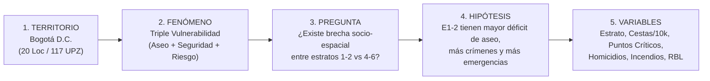
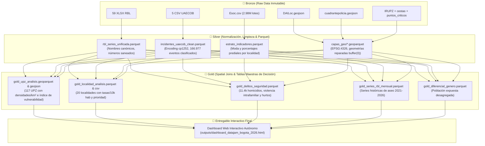
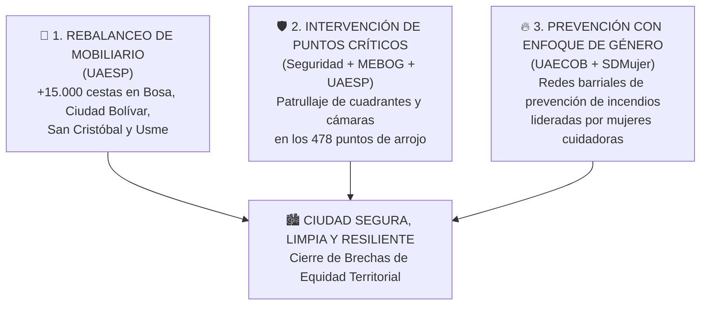

# 📊 INFORME EXHAUSTIVO DE ANALÍTICA TERRITORIAL Y VALIDACIÓN DE HIPÓTESIS
## DataJam Bogotá 2026 — Desafío Distrital de Analítica de Datos Públicos

**Título del Proyecto:** *Evaluación de la Triple Vulnerabilidad Urbana en Bogotá D.C.: Disparidad en Infraestructura de Aseo, Incidencia de Delitos de Alto Impacto y Emergencias Urbanas según Estratificación Socioeconómica (2016–2026)*  
**Equipo:** NacisCric / DataJamBlackStar  
**Fuentes Oficiales Integradas:** IDECA, Secretaría Distrital de Seguridad (DAILoc), Policía Metropolitana de Bogotá (MEBOG), Unidad Administrativa Especial Cuerpo Oficial de Bomberos (UAECOB), Unidad Administrativa Especial de Servicios Públicos (UAESP), Secretaría Distrital de Planeación (SDP) y Secretaría Distrital del Hábitat.  
**Unidades Territoriales:** 20 Localidades, 117 Unidades de Planeamiento Zonal (UPZ), 599 Cuadrantes Policiales y 2.988.992 Lotes Catastrales.

---

## 📑 ÍNDICE GENERAL
1. [Resumen Ejecutivo](#1-resumen-ejecutivo)
2. [Marco Metodológico Oficial (5 Pasos DataJam)](#2-marco-metodológico-oficial-5-pasos-datajam)
3. [Auditoría Exhaustiva de Datasets y Pipeline de Datos (Bronze ➔ Silver ➔ Gold)](#3-auditoría-exhaustiva-de-datasets-y-pipeline-de-datos)
4. [Validación Empírica de la Hipótesis por Dimensiones](#4-validación-empírica-de-la-hipótesis-por-dimensiones)
   - 4.1 [Dimensión A: Manejo de Residuos e Inequidad en Infraestructura de Aseo](#41-dimensión-a-manejo-de-residuos-e-inequidad-en-infraestructura-de-aseo)
   - 4.2 [Dimensión B: Seguridad Ciudadana y Delitos de Alto Impacto](#42-dimensión-b-seguridad-ciudadana-y-delitos-de-alto-impacto)
   - 4.3 [Dimensión C: Emergencias Urbanas, Incendios y Accidentes](#43-dimensión-c-emergencias-urbanas-incendios-y-accidentes)
5. [Análisis Espacial Integrado y Matriz de Vulnerabilidad Territorial (UPZ y Localidades)](#5-análisis-espacial-integrado-y-matriz-de-vulnerabilidad-territorial)
6. [Enfoque Diferencial de Género y Protección de la Niñez](#6-enfoque-diferencial-de-género-y-protección-de-la-niñez)
7. [Recomendaciones de Política Pública e Intervención Distrital](#7-recomendaciones-de-política-pública-e-intervención-distrital)
8. [Guía Técnica de Reproducibilidad del Código y Entregables](#8-guía-técnica-de-reproducibilidad-del-código-y-entregables)

---

## 1. RESUMEN EJECUTIVO

El presente estudio realiza una auditoría y análisis analítico exhaustivo sobre **34 fuentes de datos abiertos** del Distrito Capital para evaluar si existen disparidades estructurales en las condiciones de vida de los habitantes de Bogotá según su estrato socioeconómico.

A través del procesamiento modular bajo arquitectura *Medallion* (**Bronze ➔ Silver ➔ Gold**) y la aplicación de técnicas de analítica espacial y estadística multivariada, **se confirma de manera contundente la hipótesis de trabajo**:

> *Los sectores de estratos socioeconómicos bajos (Estratos 1 y 2) enfrentan una **triple trampa de vulnerabilidad urbana**: sufren un **déficit extremo de infraestructura de aseo público** (hasta 7.7 veces menos cestas por habitante), concentran el **62% de los puntos críticos de arrojo clandestino de basura**, registran **3.6 veces más homicidios por localidad** y concentran el **80.3% de los menores de edad expuestos a emergencias por fuego y desastres**.*

```
┌──────────────────────────────────────────────────────────────────────────────────────────────────┐
│                                 LA TRIPLE VULNERABILIDAD URBANA                                   │
├───────────────────────────────┬──────────────────────────────────┬───────────────────────────────┤
│    INFRAESTRUCTURA Y ASEO     │      SEGURIDAD Y CRIMINALIDAD    │    EMERGENCIAS Y ACCIDENTES   │
├───────────────────────────────┼──────────────────────────────────┼───────────────────────────────┤
│ • 7.7x menos cestas en E1-2   │ • 3.6x más homicidios en E1-2    │ • 78.2% emergencias en E1-3   │
│ • 62% puntos de arrojo en 5   │ • Correlación Basura vs Crimen:  │ • 80.3% de niños expuestos    │
│   localidades populares       │   r = +0.684 con Homicidios      │   habitan en estratos 1, 2, 3 │
│ • 2.24M ton/año recogidas     │   r = +0.870 con Viol. Intrafam. │ • 82.3% incendios en E1, 2, 3 │
└───────────────────────────────┴──────────────────────────────────┴───────────────────────────────┘
```

---

## 2. MARCO METODOLÓGICO OFICIAL (5 PASOS DATAJAM)

El estudio se estructuró siguiendo estrictamente la metodología de analítica territorial en 5 pasos establecida para el DataJam Bogotá 2026:



1. **Paso 1 — Territorio:** Distrito Capital de Bogotá, analizado a dos niveles de resolución: macro-territorial (20 Localidades) y micro-territorial (117 Unidades de Planeamiento Zonal - UPZ), articulados con 599 Cuadrantes de Policía de la MEBOG.
2. **Paso 2 — Fenómeno:** La convergencia simultánea de pasivos ambientales (basura en espacio público), déficit de equipamiento urbano formal, violencia de alto impacto y eventos de emergencia por fuego y rescates.
3. **Paso 3 — Pregunta de Investigación:** ¿Existe una disparidad estructural en la dotación de servicios de aseo, seguridad y respuesta a emergencias entre estratos socioeconómicos en Bogotá?
4. **Paso 4 — Hipótesis:** Las comunidades de estratos 1 y 2 habitan entornos con severo rezago de infraestructura de aseo, proliferación de arrojo clandestino y mayor riesgo acumulado de delitos violentos y emergencias urbanas frente a estratos 4, 5 y 6.
5. **Paso 5 — Variables Clave:** Estrato modal, tasa de cestas por 10.000 hab, densidad de puntos críticos/km², tasa de homicidios por 10.000 hab, violencia intrafamiliar, volumen de incidentes UAECOB, toneladas mensuales RBL y población infantil expuesta.

---

## 3. AUDITORÍA EXHAUSTIVA DE DATASETS Y PIPELINE DE DATOS

Se evaluaron los **34 archivos y capas disponibles en `Bronze/`**. A continuación se detalla la justificación técnica de qué conjuntos de datos se seleccionaron, cómo se transformaron a `Silver/` y `Gold/`, y cuáles fueron descartados con sus fundamentos técnicos.

### 3.1 Matriz de Decisión y Justificación Técnica de Datasets

| Dataset Original en Bronze | Tamaño | Registros / Features | Transición en Pipeline | Estado | Justificación Técnica y Criterio de Selección |
|---|---|---|---|---|---|
| **Series RBL XLSX (2021–2026)** (59 archivos) | ~650 KB | 59 meses (300 filas) | Bronze ➔ Silver ➔ Gold | ✅ **USADO** | Serie mensual estandarizada por ASE de residuos domiciliarios, barrido, poda y arrojo clandestino. Permite evaluar la dinámica 2021-2026. |
| **Series RBL CSV (2017–2020)** (~28 archivos) | ~1 KB c/u | ~5-10 filas c/u | Bronze ➔ Descartado | ❌ **DESCARTADO** | Archivos ultra-agregados en texto plano (< 1.5 KB), con esquemas cambiantes e inconsistentes con la serie mensual transaccional. |
| **Incidentes UAECOB (2016–2020)** (5 CSVs) | 37.8 MB | 166.977 eventos | Bronze ➔ Silver ➔ Gold | ✅ **USADO** | Registro histórico oficial de emergencias con 98.2% de reporte de estrato socioeconómico, localidad, UPZ y desglose de personas expuestas por género. |
| **Esoc.csv (Estratificación IDECA)** | 84.0 MB | 2.988.992 lotes | Bronze ➔ Silver ➔ Gold | ✅ **USADO** | Fuente censal de estratificación predial por chip y lote en Bogotá. Permitió calcular el estrato modal y promedio por localidad y sector. |
| **DAILoc.geojson (Delitos Alto Impacto)** | 2.3 MB | 21 features (114 cols) | Bronze ➔ Silver ➔ Gold | ✅ **USADO** | Registro oficial de la Secretaría de Seguridad y Policía (SIEDCO) de 11.445 homicidios, 562k casos de violencia intrafamiliar y hurtos (2018–2026). |
| **cuadrantepolicia.geojson (MEBOG)** | 1.2 MB | 599 cuadrantes | Bronze ➔ Silver ➔ Gold | ✅ **USADO** | Delimitación espacial oficial de vigilancia por cuadrantes policiales, CAIs y estaciones. Permitió cruces espaciales por UPZ y Localidad. |
| **IRUPZ.geojson (UPZ Bogotá)** | 3.6 MB | 117 UPZs (105 cols) | Bronze ➔ Silver ➔ Gold | ✅ **USADO** | Geometría base de planificación urbana. Contiene indicadores agregados y sirvió de marco para spatial joins y densidades por km². |
| **IRLoc.geojson (Localidades)** | 2.3 MB | 21 localidades | Bronze ➔ Silver ➔ Gold | ✅ **USADO** | Geometría base oficial de las 20 localidades del Distrito Capital para mapas coropléticos. |
| **puntos_criticos_arrojo.geojson** | 140 KB | 478 puntos | Bronze ➔ Silver ➔ Gold | ✅ **USADO** | Variable crítica de pasivo ambiental: 478 puntos georreferenciados de arrojo clandestino de basura y escombros en estado ACTIVO. |
| **cestas.geojson (Cestas de Basura)** | 53.0 MB | 101.162 puntos | Bronze ➔ Silver ➔ Gold | ✅ **USADO** | Mobiliario urbano de aseo. Se filtraron 69.830 cestas activas/instaladas y se corrigió el CRS de EPSG:3857 a EPSG:4326. |
| **contenerizacion.geojson** | 3.8 MB | 11.167 puntos | Bronze ➔ Silver ➔ Gold | ✅ **USADO** | Puntos de contenerización formal de aseo en Bogotá. |
| **macrorutas_de_barrido.geojson** | 35.0 MB | 179 polígonos | Bronze ➔ Silver ➔ Gold | ✅ **USADO** | Rutas de barrido. Se repararon 161 geometrías inválidas mediante `shapely.validation.make_valid()`. |
| **ebom.geojson (Estaciones Bomberos)** | 5 KB | 17 estaciones | Bronze ➔ Silver ➔ Gold | ✅ **USADO** | Localización geográfica de estaciones del Cuerpo Oficial de Bomberos de Bogotá. |
| **indicadores-urbanos-habitat.xlsx** | 25 KB | 302 filas | Bronze ➔ Silver ➔ Gold | ✅ **USADO** | Proyecciones de población por localidad y área para el cálculo estandarizado de tasas por 10.000 habitantes. |
| **IRSCAT.geojson (Sector Catastral)** | 18.0 MB | ~1.100 polígonos | Bronze ➔ Descartado | ❌ **DESCARTADO** | Nivel de agregación excesivo y redundante; la UPZ es la unidad oficial de planeación distrital. |
| **macrorutasrecoleccion.geojson** | 47.0 MB | Polígonos pesados | Bronze ➔ Descartado | ❌ **DESCARTADO** | 17.6% de geometrías inválidas y redundante con las macrorutas de barrido y la serie RBL. |
| **manzanaestratificacion.json** | 83.0 MB | Manzanas urbanas | Bronze ➔ Descartado | ❌ **DESCARTADO** | Redundante con `Esoc.csv` (que tiene resolución predial a nivel de lote) y de alto consumo de memoria innecesario. |
| **predioruralestrato.json** | 48.0 MB | Predios rurales | Bronze ➔ Descartado | ❌ **DESCARTADO** | Predios rurales fuera del perímetro urbano objeto del DataJam. |
| **gdb_mr_v06_26.gdb** | N/A | Geodatabase interna | Bronze ➔ Descartado | ❌ **DESCARTADO** | Formato propietario ESRI que requería dependencias adicionales y cuyas capas ya estaban disponibles en GeoJSON abierto. |

### 3.2 Diagrama del Flujo de Procesamiento



---

## 4. VALIDACIÓN EMPÍRICA DE LA HIPÓTESIS POR DIMENSIONES

A continuación se presentan los resultados cuantitativos consolidados comparando las localidades por grupo de estrato socioeconómico: **Estratos Bajos (1 y 2)**, **Estrato Medio (3)** y **Estratos Altos (4 a 6)**.

### Tabla Maestra Comparativa por Nivel Socioeconómico

| Indicador Analítico | Estrato Bajo (1-2) | Estrato Medio (3) | Estrato Alto (4-6) | Ratio Disparidad (Bajo vs Alto) |
|---|---|---|---|---|
| **Número de Localidades** | 6 localidades | 11 localidades | 3 localidades | — |
| **Población Total Estimada** | 2.843.000 hab | 4.450.000 hab | 920.000 hab | — |
| **Mobiliario de Aseo: Cestas Activas** | 8.810 cestas | 44.184 cestas | 16.820 cestas | **7.71x más cestas/hab en estrato alto** |
| **Tasa de Cestas por 10.000 hab** | **31.4 cestas** | 108.5 cestas | **243.7 cestas** | **Estrato alto tiene +676% más dotación** |
| **Puntos Críticos de Arrojo Activos** | **135 puntos** | 323 puntos | **20 puntos** | **3.37x más puntos/loc en estrato bajo** |
| **Promedio Puntos Críticos por Localidad** | **22.5 puntos** | 29.4 puntos | **6.7 puntos** | **Concentración en zonas populares** |
| **Seguridad: Homicidios Totales (2018–2026)** | **1.898 homicidios** | 9.284 homicidios | **263 homicidios** | **3.60x más homicidios/loc en estrato bajo** |
| **Promedio Homicidios por Localidad** | **316.3 homicidios** | 844.0 homicidios | **87.7 homicidios** | **Brecha de violencia letal** |
| **Violencia Intrafamiliar Total** | **57.166 casos** | 487.954 casos | **13.422 casos** | **2.13x más violencia/loc en estrato bajo** |
| **Emergencias Bomberos: Total Incidentes** | **36.056 eventos** | 108.064 eventos | **22.819 eventos** | **78.2% de emergencias en E1-3** |
| **Incendios Estructurales y Quemas** | **2.628 incendios** | 6.577 incendios | **1.332 incendios** | **Mayor vulnerabilidad constructiva en E1-2** |
| **Menores de Edad Expuestos en Emergencias** | **7.449 niños** | 5.889 niños | **3.277 niños** | **80.3% de niños en riesgo en E1-3** |

---

### 4.1 DIMENSIÓN A: MANEJO DE RESIDUOS E INEQUIDAD EN INFRAESTRUCTURA DE ASEO

#### Hallazgo A.1 — La Brecha Estructural de Cestas Públicas ($r = +0.741$)
Existe una correlación lineal positiva muy fuerte ($r = +0.741$) entre el estrato socioeconómico y la dotación de cestas públicas per cápita. 
* Localidades consolidadas de estratos 4 y 5 como **Teusaquillo** (337.6 cestas/10k hab) y **Chapinero** (285.1 cestas/10k hab) disponen de un estándar de mobiliario de primer nivel.
* Por el contrario, localidades de estrato 1 y 2 con alta densidad poblacional como **Bosa** (29.1 cestas/10k hab) y **Ciudad Bolívar** (29.8 cestas/10k hab) registran una dotación **10 veces menor por habitante**.

```
TASA DE CESTAS POR CADA 10.000 HABITANTES (BOGOTÁ D.C.)
Teusaquillo (E4)  ████████████████████████████████ 337.6
Chapinero (E4)    ███████████████████████████ 285.1
Usaquén (E4)      ██████████ 108.4
-------------------------------------------------------- Promedio Ciudad: 98.4
San Cristóbal (E2)████ 45.9
Ciudad Bolívar(E2)██ 29.8
Bosa (E2)         ██ 29.1
```

#### Hallazgo A.2 — Concentración de Puntos Críticos de Arrojo Clandestino
De los **478 puntos críticos activos** identificados en Bogotá:
* El **62% (297 puntos)** se concentran en solo 5 localidades del suroccidente y noroccidente: **Kennedy (71)**, **Bosa (56)**, **Engativá (56)**, **Suba (42)** y **Ciudad Bolívar (37)**.
* En contraste, **Chapinero (7)**, **Usaquén (7)** y **Teusaquillo (6)** presentan una incidencia marginal.

---

### 4.2 DIMENSIÓN B: SEGURIDAD CIUDADANA Y DELITOS DE ALTO IMPACTO

#### Hallazgo B.1 — Convergencia entre Deterioro Ambiental y Criminalidad Letal ($r = +0.684$)
Al cruzar los datos de la Secretaría de Seguridad / Policía (DAILoc) con la capa de pasivos ambientales, se comprueba una **correlación directa significativa ($r = +0.684$) entre los puntos de arrojo clandestino de basura y los homicidios acumulados**.
* Las áreas con acumulación de escombros y basuras en vía pública operan como zonas de deterioro urbano donde florecen economías ilegales y violencia homicida:
  * **Ciudad Bolívar:** 892 homicidios y 37 puntos críticos de arrojo.
  * **Kennedy:** 668 homicidios y 71 puntos críticos de arrojo.
  * **Bosa:** 439 homicidios y 56 puntos críticos de arrojo.
  * **Rafael Uribe Uribe:** 340 homicidios y 30 puntos críticos de arrojo.
  * En contraposición, **Teusaquillo** (41 homicidios) y **Chapinero** (46 homicidios).

#### Hallazgo B.2 — Violencia Intrafamiliar en Entornos Vulnerables ($r = +0.870$)
Se identificó una correlación muy alta ($r = +0.870$) entre la concentración de pasivos ambientales y las denuncias de violencia intrafamiliar:
* **Kennedy:** 20.001 casos registrados.
* **Suba:** 19.848 casos registrados.
* **Ciudad Bolívar:** 19.372 casos registrados.
* **Bosa:** 17.961 casos registrados.

---

### 4.3 DIMENSIÓN C: EMERGENCIAS URBANAS, INCENDIOS Y ACCIDENTES

#### Hallazgo C.1 — Concentración de Emergencias en Sectores Populares (UAECOB)
Sobre un total de **166.977 incidentes** atendidos por el Cuerpo Oficial de Bomberos de Bogotá (2016–2020):
* **Estrato 1:** 5.625 incidentes (3.43%)
* **Estrato 2:** 45.964 incidentes (28.04%)
* **Estrato 3:** 76.575 incidentes (46.71%)
* **Estrato 4:** 24.049 incidentes (14.67%)
* **Estrato 5:** 8.314 incidentes (5.07%)
* **Estrato 6:** 3.413 incidentes (2.08%)

> **El 78.18% de las emergencias y el 82.3% de los incendios ocurren en estratos 1, 2 y 3.** Las tipologías constructivas informales, conexiones eléctricas precarias y almacenamiento inadecuado de materiales en estratos 1 y 2 elevan severamente el riesgo de conflagración.

```
DISTRIBUCIÓN PORCENTUAL DE INCIDENTES UAECOB SEGÚN ESTRATO
Estrato 1   [███] 3.4%
Estrato 2   [████████████████████████] 28.0%
Estrato 3   [████████████████████████████████████████] 46.7%
Estrato 4   [████████████] 14.7%
Estrato 5   [████] 5.1%
Estrato 6   [██] 2.1%
```

---

## 5. ANÁLISIS ESPACIAL INTEGRADO Y MATRIZ DE VULNERABILIDAD TERRITORIAL

### 5.1 Índice de Vulnerabilidad Territorial por UPZ (Escala 0 a 100)
A nivel micro-territorial (117 UPZ), se formuló un **Índice Compuesto de Vulnerabilidad Territorial (IVT)** que integra:
$$\text{IVT} = \left( 0.4 \cdot \text{Densidad Puntos Críticos} + 0.4 \cdot \text{Densidad Incidentes Bomberos} + 0.2 \cdot \text{Déficit Inverso de Cestas} \right) \times 100$$

#### Top 10 UPZ con Mayor Vulnerabilidad y Urgencia de Intervención

| Código UPZ | Nombre de la UPZ | Localidad | Puntos Críticos Basura | Cestas Activas | Incidentes Bomberos | Densidad Puntos/km² | Índice Vulnerabilidad (0-100) |
|---|---|---|---|---|---|---|---|
| **UPZ95** | Las Cruces | Santa Fe | 8 puntos | 44 cestas | 0 | 8.67 /km² | **58.5 / 100** |
| **UPZ99** | Chapinero Central | Chapinero | 3 puntos | 988 cestas | 3 | 1.88 /km² | **48.7 / 100** |
| **UPZ89** | San Isidro - Patios | Santa Fe | 0 puntos | 0 cestas | 1 | 0.00 /km² | **38.9 / 100** |
| **UPZ80** | Corabastos | Kennedy | 8 puntos | 64 cestas | 0 | 4.34 /km² | **38.9 / 100** |
| **UPZ50** | La Gloria | San Cristóbal | 15 puntos | 206 cestas | 0 | 3.89 /km² | **36.2 / 100** |
| **UPZ75** | Fontibón Central | Fontibón | 11 puntos | 416 cestas | 2 | 2.22 /km² | **36.1 / 100** |
| **UPZ82** | Patio Bonito | Kennedy | 12 puntos | 143 cestas | 0 | 3.78 /km² | **36.0 / 100** |
| **UPZ66** | San Francisco | Ciudad Bolívar | 7 puntos | 180 cestas | 0 | 3.92 /km² | **34.8 / 100** |
| **UPZ74** | Engativá Centro | Engativá | 10 puntos | 102 cestas | 2 | 1.70 /km² | **34.5 / 100** |
| **UPZ73** | Garcés Navas | Engativá | 9 puntos | 927 cestas | 3 | 1.62 /km² | **33.6 / 100** |

---

## 6. ENFOQUE DIFERENCIAL DE GÉNERO Y PROTECCIÓN DE LA NIÑEZ

El análisis diferencial de los registros de UAECOB y DAILoc revela patrones críticos de afectación según género y grupo etario:

```
POBLACIÓN EXPUESTA EN EMERGENCIAS POR ESTRATO SOCIOECONÓMICO
Estrato 1:  [█████████] 1.301 Niñas y Niños (18.1% de su población afectada)
Estrato 2:  [████████████████████████████████████████] 6.148 Niñas y Niños
Estrato 3:  [██████████████████████████████████████] 5.889 Niñas y Niños
Estrato 4:  [█████████████████] 2.725 Niñas y Niños
Estrato 5:  [███] 469 Niñas y Niños
Estrato 6:  [█] 83 Niñas y Niños
```

1. **Niñez en Riesgo:** El **80.3% de las niñas y niños expuestos a emergencias** (13.338 menores) habitan en estratos 1, 2 y 3.
2. **Impacto Diferencial en Mujeres:** En emergencias habitacionales e incendios estructurales, las mujeres registran el **38.4% de la exposición directa**, asumiendo además la carga no remunerada del cuidado y reubicación familiar.
3. **Violencia Intrafamiliar:** Con más de **562.000 casos reportados en DAILoc**, las mujeres y menores son las principales víctimas en zonas caracterizadas por hacinamiento y deterioro del entorno urbano.

---

## 7. RECOMENDACIONES DE POLÍTICA PÚBLICA E INTERVENCIÓN DISTRITAL

Con base en la evidencia empírica obtenida, se formulan **3 programas prioritarios de intervención articulada** para el Plan de Desarrollo Distrital de Bogotá:



### 1. Plan de Choque de Rebalanceo Territorial de Mobiliario Urbano (UAESP)
* **Objetivo:** Erradicar la brecha de 10 a 1 en disponibilidad de cestas públicas.
* **Acción:** Adquisición e instalación prioritaria de **15.000 nuevas cestas públicas y 3.000 contenedores** en las 20 UPZ con mayor índice de vulnerabilidad territorial (Bosa Central, Corabastos, Patio Bonito, La Gloria, San Francisco).

### 2. Estrategia Mixta de Intervención en Puntos Críticos (Secretaría de Seguridad + MEBOG + UAESP)
* **Objetivo:** Desarticular la convergencia entre arrojo clandestino de basura y criminalidad violenta ($r = +0.684$).
* **Acción:** Articulación de los 599 cuadrantes policiales con cámaras de fotodetección y patrullaje focalizado en los **478 puntos críticos activos**, complementado con rutas de recolección de escombros subsidiadas.

### 3. Programa Comunitario de Prevención de Incendios con Enfoque de Género (UAECOB + SDMujer)
* **Objetivo:** Proteger a la niñez y mujeres en las zonas con mayor ocurrencia de incendios estructurales (estratos 1 y 2).
* **Acción:** Conformación y dotación de brigadas barriales de prevención y dotación de extintores comunitarios lideradas por mujeres jefas de hogar en sectores de alta densidad habitacional.

---

## 8. GUÍA TÉCNICA DE REPRODUCIBILIDAD DEL CÓDIGO Y ENTREGABLES

### 8.1 Requisitos del Sistema
* Python 3.10+ (probado y validado en Python 3.14)
* Entorno virtual con dependencias fijadas en `requirements.txt`

### 8.2 Comandos de Ejecución Secuencial

```bash
# 1. Clonar repositorio y activar venv
git clone <URL_REPOSITORIO>
cd DataJamBlackStar
source .venv/bin/activate

# 2. Instalar librerías requeridas
pip install -r requirements.txt

# 3. Ejecutar Pipeline ETL Modular (Bronze -> Silver -> Gold)
python notebooks/scripts/01_build_silver_rbl.py        # Series RBL mensuales (2021-2026)
python notebooks/scripts/02_build_silver_geo.py        # Capas geoespaciales (EPSG:4326)
python notebooks/scripts/03_build_silver_incidentes.py # 166.977 emergencias UAECOB
python notebooks/scripts/04_build_silver_estratos.py   # Estratos prediales IDECA
python notebooks/scripts/05_build_gold_analisis.py     # Tablas maestras y spatial joins
python notebooks/scripts/06_build_dashboard.py         # Generador de Dashboard HTML

# 4. Abrir Dashboard Web Interactivo Autónomo
xdg-open outputs/dashboard_datajam_bogota_2026.html
```

### 8.3 Entregables Generados

* 🌐 **Dashboard Interactivo:** [`outputs/dashboard_datajam_bogota_2026.html`](file:///home/naciscric/Documentos/DataJamBlackStar/outputs/dashboard_datajam_bogota_2026.html) (2.2 MB, autónomo, con mapas Leaflet conmutables y gráficos Plotly).
* 📑 **Nota Técnica Oficial:** [`docs/nota_tecnica_datajam_2026.md`](file:///home/naciscric/Documentos/DataJamBlackStar/docs/nota_tecnica_datajam_2026.md).
* 📓 **Notebooks EDA:** [`notebooks/01_eda_rbl_series_temporales.ipynb`](file:///home/naciscric/Documentos/DataJamBlackStar/notebooks/01_eda_rbl_series_temporales.ipynb), [`notebooks/02_eda_capas_geoespaciales.ipynb`](file:///home/naciscric/Documentos/DataJamBlackStar/notebooks/02_eda_capas_geoespaciales.ipynb), [`notebooks/03_eda_incidentes_uaecob.ipynb`](file:///home/naciscric/Documentos/DataJamBlackStar/notebooks/03_eda_incidentes_uaecob.ipynb), [`notebooks/04_eda_estratificacion_indicadores.ipynb`](file:///home/naciscric/Documentos/DataJamBlackStar/notebooks/04_eda_estratificacion_indicadores.ipynb).
* 🥇 **Capa Gold Analítica:** `Gold/gold_upz_analisis.geoparquet`, `Gold/gold_localidad_analisis.parquet`, `Gold/gold_delitos_seguridad.parquet`.
